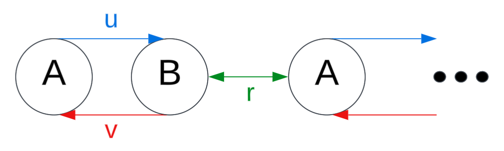
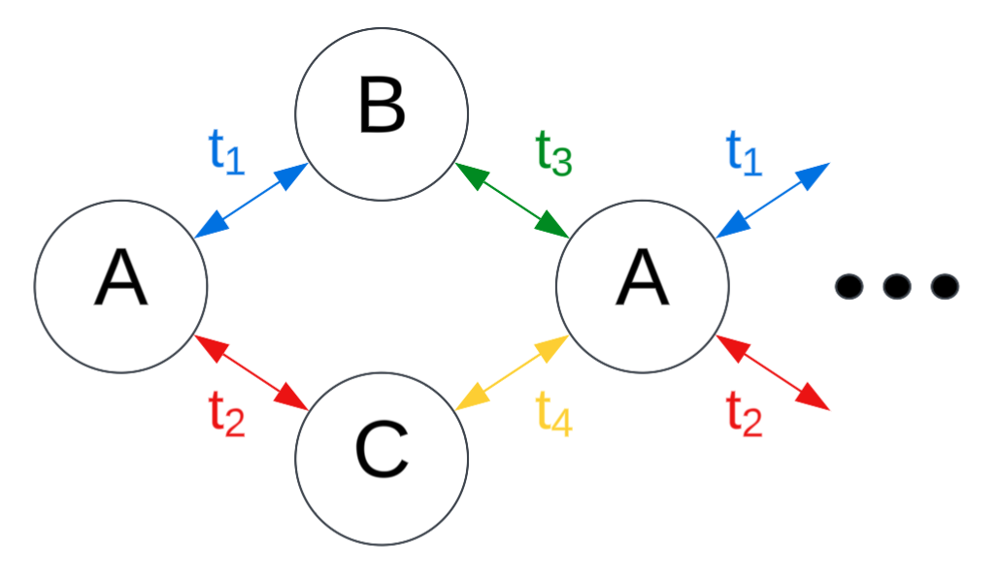

# Dynamics of Topological Photonics with Nonlinear Saturable Gain and Loss

This repository contains a revised version of the code from my dissertation at Lancaster University, developed under the supervision of Dr. Henning Schomerus. The project explores the fascinating intersection of **topology**, **nonlinear optics** and **quantum physics**, by studying edge modes and nonlinear dynamics of photonic lattices through comprehensive phase diagram analysis.

## Table of Contents
1. [Why This Matters](#why-this-matters)
2. [Overview](#overview)🧠
3. [Methodology](#methodology)🔬
4. [Project Structure](#project-structure)
5. [Quick Start](#quick-start)⚡
6. [Key Technical Achievements](#-key-technical-achievements)🔑

## Why This Matters

### 🔴 **Advanced Laser Physics**
Understanding how nonlinear gain saturation and loss effects interact in topological lattice systems provides crucial insights for developing next-generation laser technologies. The phase diagrams reveal optimal operating conditions for various laser applications, from high-power semiconductor lasers to exotic chaotic mode-locked systems.

### 🌟 **Novel Optical Phenomena**
The research uncovers complex phase behaviors including:
- **Chaotic lasing regimes** with potential applications in short-pulsed, high peak-power lasers
- **First and second-order phase transitions** that could enable new types of optical switching
- **Critical points** where systems exhibit extreme sensitivity, useful for precision sensing applications

### 🔮 **Quantum Computing Potential**
The lattice models show promising connections to quantum computing architectures:
- **Quantum Annealing**: Phase diagrams could potentially map computational complexity regimes and help optimize quantum algorithms
- **Nonlinear Operations**: Nonlinear gain saturation might represent nonlinear quantum operators that enhance readout signals
- **Decoherence Modeling**: Loss parameters could model environmental decoherence, noise, and quantum errors
- **Topological Connections**: The exchange matrices studied relate to mathematical structures used in topological error correction codes like the toric code

### 🎯 **Real-World Impact**
This research bridges fundamental physics with practical applications:
- **Materials Science**: Understanding dimerization effects in atoms and molecules for developing new optical materials
- **Fiber Optics**: If one were to adapt this code to include nonlinear **loss**, then insights into soliton dynamics and nonlinear wave propagation are possible
- **Quantum Technologies**: Framework for analyzing types of decoherence and error rates in quantum systems

By studying these topological phase diagrams, we gain powerful insights into how complex systems behave under competing effects of gain and loss—knowledge that's essential for advancing both fundamental physics and cutting-edge technologies.

## Overview
We study two main lattice models:

1. **Non-reciprocal SSH (NRSSH) Model** - A variation of the Su–Schrieffer–Heeger model with unequal (non-reciprocal) intra-cell hopping in opposite directions.



2. **Diamond (Rhombic) Model** - A lattice with three sites per unit cell (A, B, C). Hoppings occur between A-B and A-C but not between B and C. Different hopping configurations lead to various "dimerizations" and exotic laser phases.



Gain and loss distribution will be different between these models, which will result in exclusive properties.
A temporal criterion is formulated to indicate whether the systems have converged / diverged into a final state - dependent on site intensities.
These final state times draw out phase diagrams of gain against loss, which are different for each combination of hopping strengths and saturation.

## Methodology

See [THEORY.md](THEORY.md) for a more-extensive description of the physics behind this project.

### 1. **Hamiltonian Construction**
Hamiltonians are defined by populating the matrix entry $[i, j]$ with the hopping strength from site $j$ to $i$.  
We compute and visualize:
- **Band structure** in momentum($k$)-space
- **Edge states** in real space (finding topologically protected modes)

### 2. **Inclusion of Gain and Loss**
- Introduced as imaginary onsite potential terms.
- Gain features **nonlinear saturation** controlled by intensity and a saturation parameter $S$.
- $\gamma_1$ (gain) and $\gamma_2$ (loss) are tunable parameters.
- For the NRSSH model: all sites have both gain and loss terms.
- For the diamond model: A sites have gain, B and C sites have loss.

### 3. **Time Evolution**
We evolve the system:
- Using a **2nd-order time evolution operator** $U(t)$ to generate $\varphi(t + dt)$ from $\varphi(t)$.
- Evolution is repeated for 50 steps (the number of colours in the colour-map).

### 4. **Steady-State Detection**
The system is evolved until the change in total intensity between time steps falls below a chosen **tolerance** parameter.
The site intensities moments before reaching this final state are visualized.

### 5. **Phase Diagram Generation**
Simulations are ran over 100s of parameter combinations to create **phase diagrams**. These help analyze:
- Phases that host topologically-protected edge modes
- Stability vs chaos
- Loss-dominated and hybrid lasing modes

## Project Structure

```
Dynamics_of_Topological_Photonics/
├── LICENSE                               # MIT License text
├── README.md                             # This file
├── THEORY.md                             # File explaining the physics behind this project
├── RESULTS.md                            # Results, conclusions and evaluations
├── pyproject.toml                        # Package metadata and install configuration
├── requirements.txt                      # Packages required to be installed
├── images/                               # Curated figures referenced by the markdown docs
│   ├── eigensolutions/
│   ├── intensities/
│   ├── lattice_structures/
│   └── phases/
│       ├── diamond_phases/
│       └── nrssh_phases/
├── topological_photonics/                 # Source code
│   ├── models/
│   │   ├── __init__.py
│   │   ├── nrssh_lattice.py              # Builds the operators for the NRSSH model
│   │   └── diamond_lattice.py            # Builds the operators for the Diamond model
│   ├── dynamics/
│   │   ├── __init__.py
│   │   ├── nrssh_time_evolution.py       # Evolves the NRSSH model
│   │   ├── nrssh_gain_loss.py            # Generates the NRSSH model's final states
│   │   ├── diamond_time_evolution.py     # Evolves the Diamond model
│   │   └── diamond_gain_loss.py          # Generates the Diamond model's final states
│   └── phases/
│       ├── __init__.py
│       ├── nrssh_phase_diagrams.py       # Plots the NRSSH model's phase diagram
│       └── diamond_phase_diagrams.py     # Plots the Diamond model's phase diagram
├── tests/                                # Automated tests
│   └── test_models_and_phases.py
├── outputs/                              # Generated plots from local runs (git-ignored)
└── examples/                             # Example plotting scripts
    ├── nrssh_examples/
    │   ├── nrssh_eigenenergies.py        # Plots eigenenergies
    │   ├── nrssh_eigenvectors.py         # Plots eigenvectors
    │   ├── nrssh_first_moments.py        # Plots first states
    │   ├── nrssh_last_moments.py         # Plots final states
    │   └── nrssh_phases.py               # Plots phase diagrams
    └── diamond_examples/
        ├── diamond_eigenenergies.py      # Plots eigenenergies
        ├── diamond_eigenvectors.py       # Plots eigenvectors
        ├── diamond_first_moments.py      # Plots first states
        ├── diamond_last_moments.py       # Plots final states
        └── diamond_phases.py             # Plots phase diagrams
```

## Generated Output Policy

The `images/` directory is reserved for curated figures referenced by `README.md`, `THEORY.md`, and `RESULTS.md`.
Example scripts and plotting utilities write new PNGs to the git-ignored `outputs/` directory by default.
If a newly generated figure should become part of the documented results, move it deliberately from `outputs/` into `images/` and update the relevant markdown reference.

## Quick Start

1. **Clone the Repository**
```bash
git clone https://github.com/SidRichardsQuantum/Dynamics_of_Topological_Photonics.git
cd Dynamics_of_Topological_Photonics
```

2. **Install the project**
```bash
pip install -e .
```

3. **Run tests**
```bash
python -m unittest discover -s tests
```

4. **Generate the Default NRSSH Phase Diagram**
```bash
python examples/nrssh_examples/nrssh_phases.py
```
Generated plots are written to `outputs/` by default. The tracked `images/` directory is reserved for curated figures used by the markdown documentation. To write example outputs somewhere else, set `TOPOPHOTONICS_OUTPUT_DIR`:

```bash
TOPOPHOTONICS_OUTPUT_DIR=/tmp/topophotonics python examples/nrssh_examples/nrssh_phases.py
```

When calling plotting functions directly, pass `output_dir="/path/to/output"` to choose the destination directory.

5. **Or Generate a Custom NRSSH Phase Diagram**
```python
'''examples.nrssh_examples.nrssh_phases.py'''
from topological_photonics.phases.nrssh_phase_diagrams import plot_example_phase_diagram

# v, u, r in the interval (0, 1]
# S >= 0
# Recommended that points are between 15 and 30
if __name__ == "__main__":
         gamma1_arr, gamma2_arr, conv_times, conv_mask = plot_example_phase_diagram(
            v=0.3, u=0.2, r=0.9, S=1.0, points=20, verbose=True)
```

## 🔑 **Key Technical Achievements**

**Temporal Criterion Development**
- Established robust temporal evolution criteria for phase classification.
- Validated phase diagram generation methodology across different lattice geometries.
- Demonstrated scalability of the approach to complex multi-parameter spaces.

**Stability Analysis**
- Successfully prevented unstable phases in systems with non-zero gain saturation and appropriate dimerization.
- Characterized conditions where systems reach stable final states versus continuous evolution.
- Mapped parameter spaces that avoid optical damage thresholds.

**Physical Correspondence**
- Established clear connections between phase behaviors and real laser dynamics.
- Demonstrated relevance to semiconductor laser saturation effects and high-power applications.
- Confirmed applicability to quantum walks, annealing and topological quantum computing scenarios.

These results provide a comprehensive framework for understanding and predicting the behavior of complex topological systems under competing gain and loss effects, with immediate applications in laser design and nonlinear optics research, and potentially in (topological) quantum computing and annealing.

See [RESULTS.md](RESULTS.md) for results, conclusions and evaluations.

---

📘 Author: Sid Richards (SidRichardsQuantum)

 LinkedIn: https://www.linkedin.com/in/sid-richards-21374b30b/

This project is licensed under the MIT License - see the [LICENSE](LICENSE) file for details.
