# Results

## **NRSSH Results**

### Eigensolutions

The eigenvalues for the NRSSH Hamiltonian were plotted in $k$-space, in the first Brillouin zone.
As the model's Hamiltonian is independent of $k$, we plot two sets of eigenenergies (red and blue) to fully visualise the bands.
Below is a plot for the NRSSH lattice in the topologically-insulating phase.

  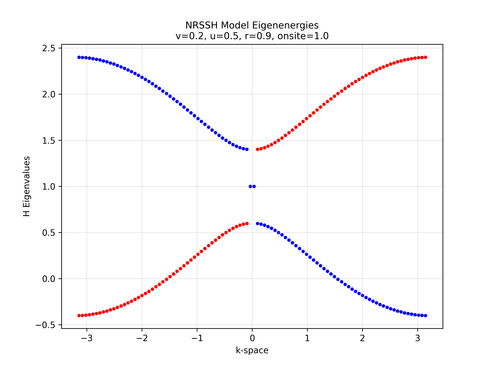

In the plot above, there are two isolated states with onsite energy in the band gap - these are the edge modes.
These edge modes have the corresponding eigenvector below:

  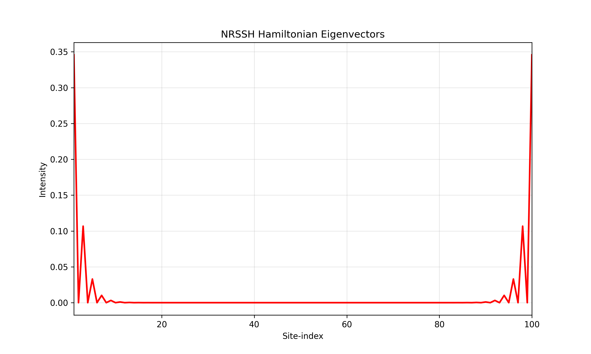

Here, the bulk-boundary correspondence is clear.
The photons are entirely on the edges of the lattice, diminishing in intensity going further into the bulk.

### Phase Diagrams

Below is a complete phase diagram for the saturated NRSSH model.
The times taken for the system to reach a final state are continuous in the lossy phase, which appears slightly above the line $\gamma_1 = (1 + S)\gamma_2 = 2\gamma_2$.
In the lossy phase, no laser-amplification is achieved as the loss term causes the energy to dissipate too quickly.
Below this 1st-order phase transition line (the laser threshold), is the gain-dominated (laser-oscillation) phase.

  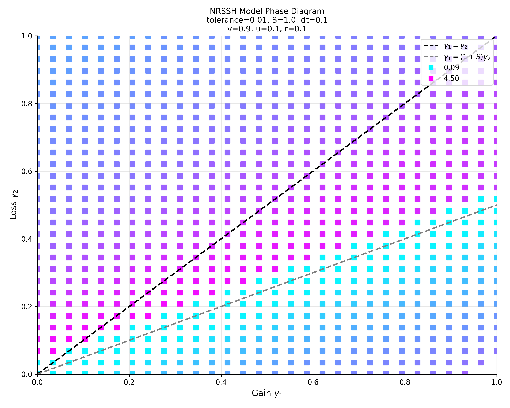

To analyse the effects of saturation, we reduce the NRSSH model to the tight-binding (TB) by making all hopping strengths equal.
Below, is an unsaturated TB lattice phase diagram - which displays a lossy and unstable phase.
As there is no saturation, everywhere below the line $\gamma_1 = \gamma_2$, the intensities grow exponentially such that the tolerance condition is never satisfied.
An unsaturated optical laser system in this unstable phase would become too intense and melt/damage the lattice.

  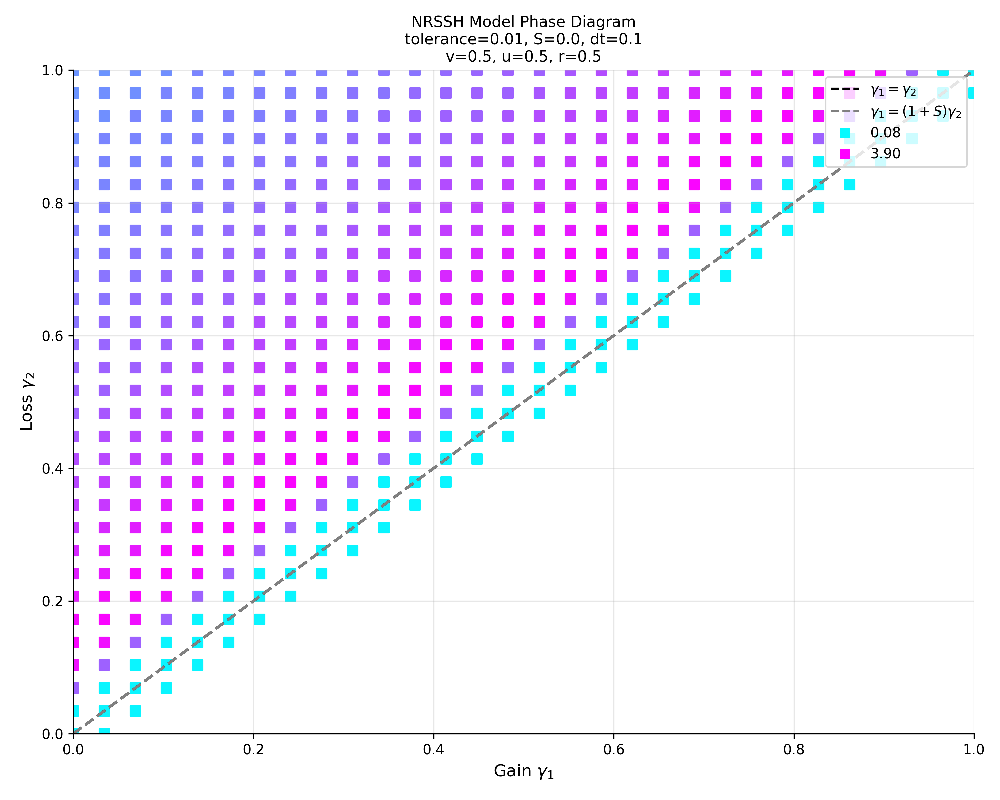

Below is a NRSSH system that has a chaotic phase, where final times are limited to 175 units.
Points in the chaotic phases appear to take a long time to reach a final state, and there is variation in final times among these points.
Chaotic points are highly-sensitive to initial conditions.
Realisations of systems in this phase can be used for short-pulse lasing, since slight changes in saturation and/or hopping strengths can drastically change the laser's intensities.

  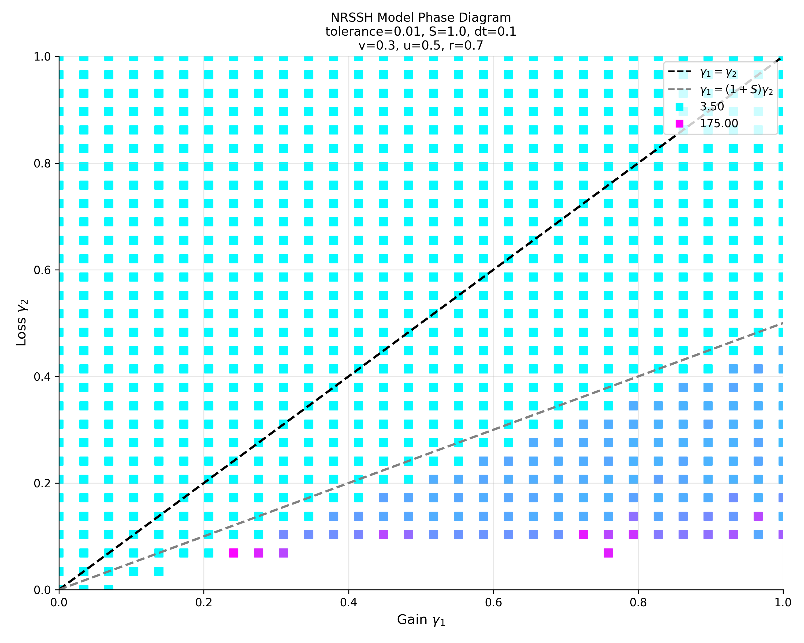

### NRSSH Findings

**Phase Behavior Discovery**
- Discovered 1st-order phase transitions leading to chaotic regimes when gain saturation mediates prominent nonlinearities.
- Mapped lasing threshold discontinuities influenced by system parameters.

**Temporal Dynamics**
- Revealed irregular chaotic behavior with hyper-sensitivity to initial conditions.
- Demonstrated that chaotic phases correspond to oscillating phases.

## **Diamond Results**

### Eigensolutions

The diamond lattice band structure also hosts states with onsite-energy, for all $k$-space values.
Bands still appear to form at the top and bottom, such that there is still a gap with no "bridge" over these unavilable states.

  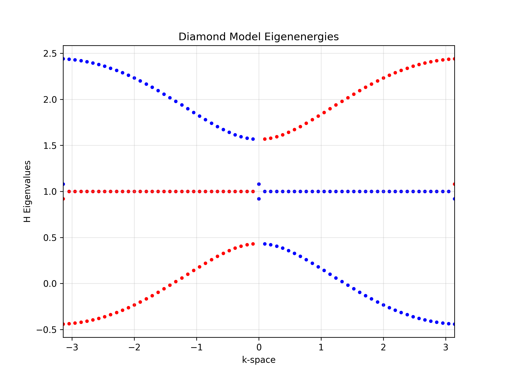

Below is the eigenstate akin to one of the onsite-energy points at $k=0$.

  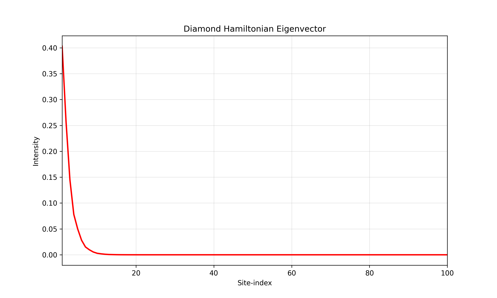

### Phase Diagrams

  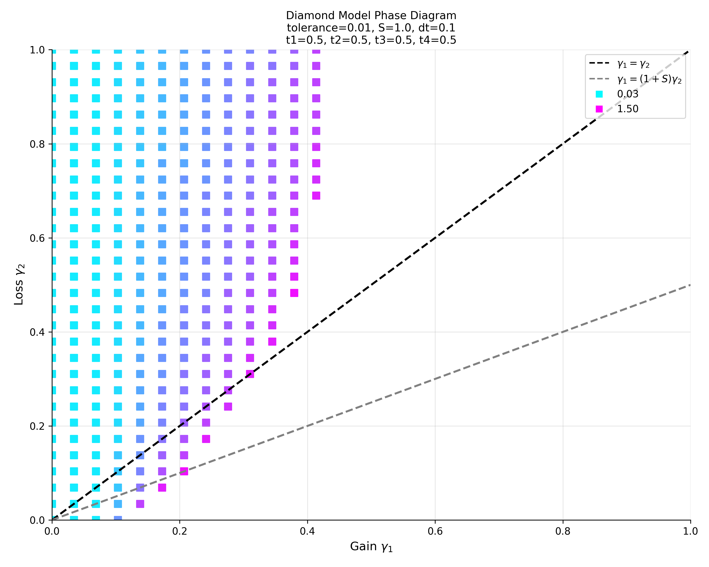

  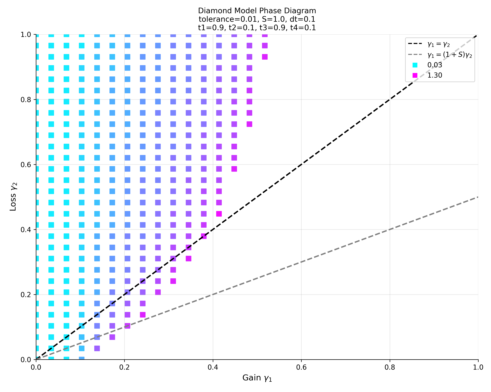

  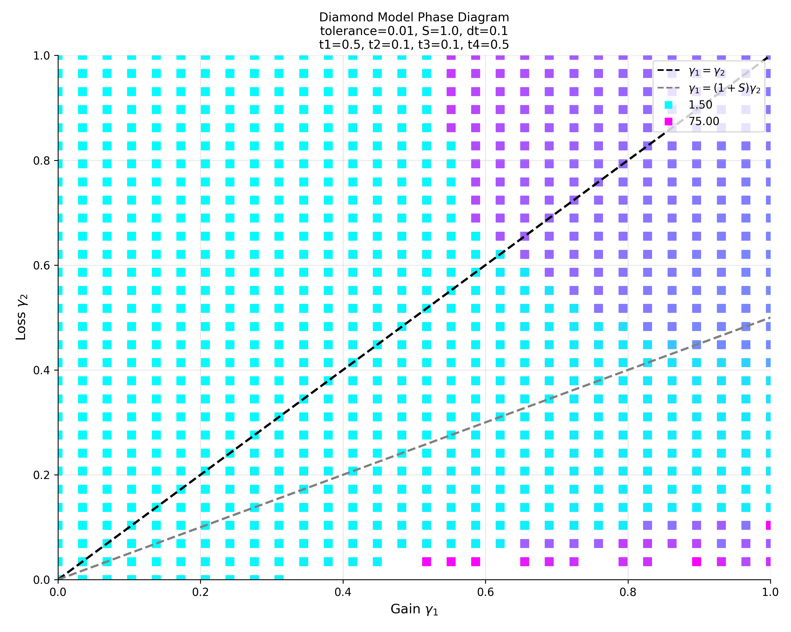

  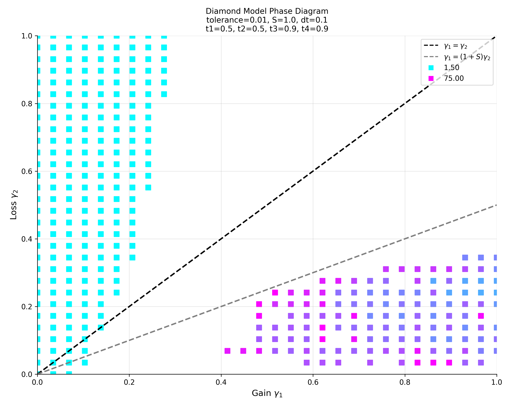

### Diamond Findings

**Complex Phase Structure**
- Uncovered additional phase types beyond the NRSSH model, including mixed phases.
- Identified exclusive stable phases in face-dimerized systems with higher final times compared to lossy stable regions.
- Found that only saturated systems without neighboring-dimerization can enter chaotic phases.

**Critical Phase Transitions**
- Documented both 1st-order and 2nd-order phase transitions between stable and chaotic phases.
- Discovered non-linear phase transition curves.
- Identified critical points where phase transition curves gradually shift from 1st-order to 2nd-order behavior.

---

📘 Author: Sid Richards (SidRichardsQuantum)

 LinkedIn: https://www.linkedin.com/in/sid-richards-21374b30b/

This project is licensed under the MIT License - see the [LICENSE](LICENSE) file for details.
