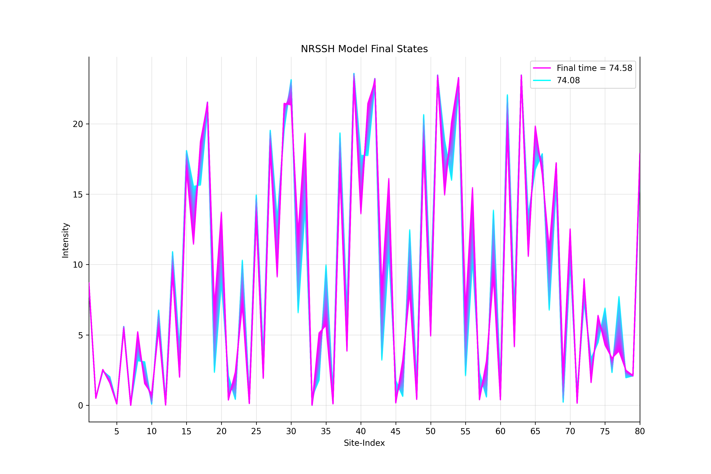
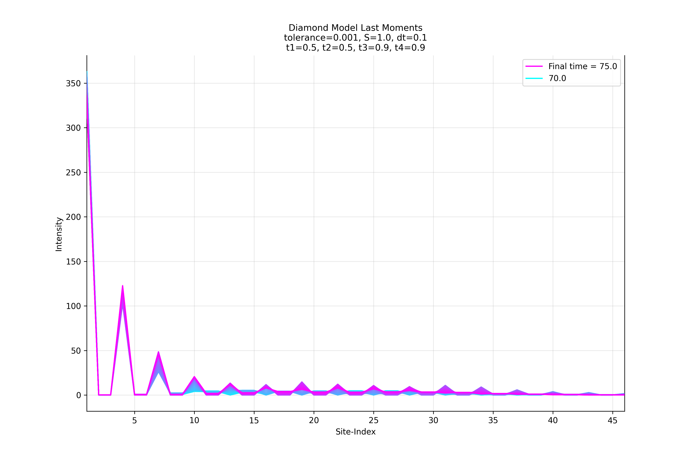
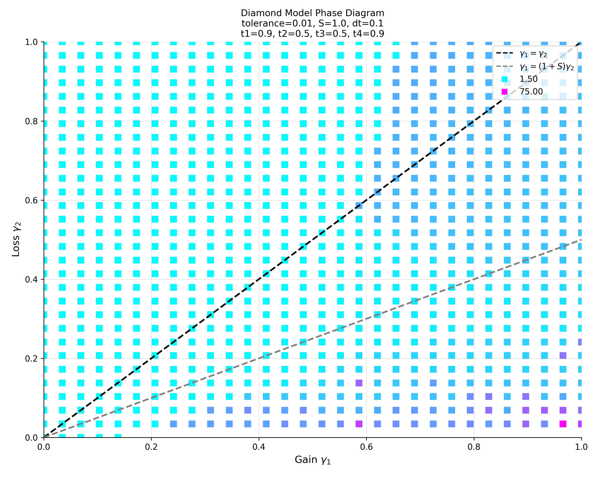
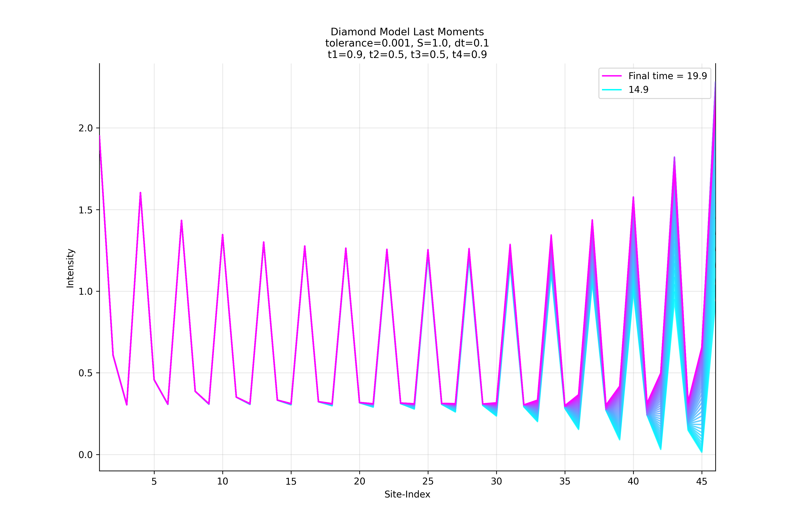
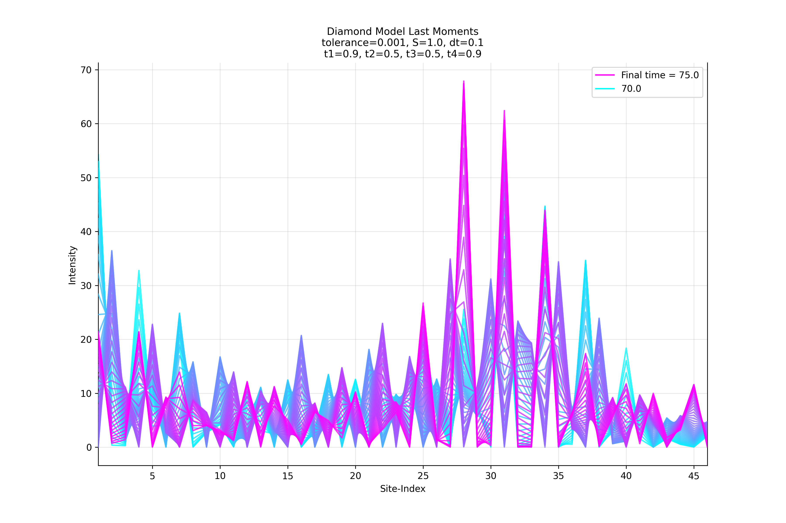

# Results

## **NRSSH Results**

### Eigensolutions

The eigenvalues for the NRSSH Hamiltonian were plotted in $k$-space, in the first Brillouin zone.
As the model's Hamiltonian is independent of $k$, we plot two sets of eigenenergies (red and blue) to fully visualise the bands.
Below is a plot for the NRSSH lattice in the topologically-insulating phase.

  

In the plot above, there are two isolated states with onsite energy in the band gap - these are the edge modes.
These edge modes have the corresponding eigenvector below:

  

Here, the bulk-boundary correspondence is clear.
The photons are entirely on the edges of the lattice, diminishing in intensity going further into the bulk.

### Phase Diagrams

Below is a complete phase diagram for the saturated NRSSH model.
The times taken for the system to reach a final state are continuous in the lossy phase, which appears slightly above the line $\gamma_1 = (1 + S)\gamma_2 = 2\gamma_2$.
In the lossy phase, no laser-amplification is achieved as the loss term causes the energy to dissipate too quickly.
Below this 1st-order phase transition line (the laser threshold), is the gain-dominated (laser-oscillation) phase.

  

#### Saturation Effects

To analyse the effects of saturation, we reduce the NRSSH model to the tight-binding (TB) by making all hopping strengths equal.
Below, is an unsaturated TB lattice phase diagram - which displays a lossy and unstable phase.
As there is no saturation, everywhere below the line $\gamma_1 = \gamma_2$, the intensities grow exponentially such that the tolerance condition is never satisfied.
An unsaturated optical laser system in this unstable phase would become too intense and melt/damage the lattice.

  

#### Chaos

Below is a NRSSH system that has a chaotic phase, where final times are limited to 175 units.
Points in the chaotic phases appear to take a long time to reach a final state, and there is variation in final times among these points.
Chaotic points are highly-sensitive to initial conditions.
Realisations of systems in this phase can be used for short-pulse lasing, since slight changes in saturation and/or hopping strengths can drastically change the laser's intensities.

  

Below displays the nature of such chaos, at the point $(\gamma_1 = 0.9, \gamma_2 = 0.15)$ in the diagram above.
Here, behaviour is unpredictable and the tolerance condition is satisfied by chance - hence the variation in final times in the chaotic phase.
Realistically, no coherent beam would be produced for a laser in this phase - making it impractical.
The only potential application for such a laser phase could be short-pulsed lasing, utilizing the chaos and rapid changes of the system.

  

### NRSSH Findings

**Phase Behavior Discovery**
- Discovered 1st-order phase transitions leading to chaotic regimes when gain saturation mediates prominent nonlinearities.
- Mapped lasing threshold discontinuities influenced by system parameters.

**Temporal Dynamics**
- Revealed irregular chaotic behavior with hyper-sensitivity to initial conditions.
- Demonstrated that chaotic phases correspond to oscillating phases.

## **Diamond Results**

### Eigensolutions

The diamond lattice band structure also hosts states with onsite-energy, for all $k$-space values.
The eigenvalue plot shows "hybridization", as there are two localised states at $k=0$ with energy near the onsite.
Bands still appear to form at the top and bottom, such that there is still a gap with no continuous "bridge" over these unavilable states, though there is some cross-over with the hybrid states.

  

Below is one of the hybrid eigenstates at $k = 0$.
(The other hybrid state is for the other edge.)

  

### Phase Diagrams

#### Trivial

When all hopping strengths are equal for the diamond model, its properties are trivial.
Unlike the NRSSH model, the 1st-order phase transition line between the lossy and unstable phases are not linear.
This is because there are twice as many lossy sites (B and C) than gain sites (A).
We have still included the line $\gamma_1 = (1 + S)\gamma_2$ as a visual gauge for the saturation $S$.

  

#### Neighbouring-Dimerization

For diamond models with neighbouring-dimerization, the behaviour is closer to that of the TB model's.
This is expected when visualising the chain, as a neighbour-dimerized diamond lattice then (practically) resembles two TB chains weakly-coupled at the A-sites if $t_1 >> t_2$ (or vice versa).
Behaviour for neighbour-dimerized lattices are also trivial, as only the lossy and unstable phases exist.

  

#### Intra Vs Inter

When the intra-cell hopping strengths are equal to each other, but different to the equal inter-cell's - the system behaviour practically resembles two identical SSH models coupled at the A-sites.

  

There is chaotic phase with high final times in the bottom right of the diagram, where edge modes are formed.
Below is the point $(\gamma_1 = 0.9, \gamma_2 = 0.15)$, where the wavefunction gets trapped on the initial A-site and grows exponentially (notice the total intensity).
Realistically, this leads to optical damage because the edge becomes too intense.

  

#### Facing-Dimerization

Face-dimerized diamond models are the most interesting, because they exhibit stable topological phases that take a lot longer to stablize.
Phase transitions between this stable phase and the lossy phase are generally of the 1st-order.
However, it is possible to tune the hopping strengths such that a critical point can be seen in our diagram.
Below, is a phase diagram with a cirtical point around $(\gamma_1 = 0.95, \gamma_2 = 0.35)$.
At this critical point, the phase transition gap diminishes and the transition becomes of the 2nd-order.

  

The point $(\gamma_1 = 0.9, \gamma_2 = 0.8)$ in the diagram above, evolves into an edge mode shown below.
The cell intensities exponentially diminish further into the bulk.
This is the non-Hermitian skin effect.

  

Below is the point $(\gamma_1 = 0.9, \gamma_2 = 0.05)$ in the chaotic phase of the same diagram.
Again, a laser in the chaotic phase is impractical.

  

### Diamond Findings

**Complex Phase Structure**
- Uncovered additional phase types beyond the NRSSH model, including mixed phases.
- Identified exclusive stable phases in face-dimerized systems with higher final times compared to lossy stable regions.
- Found that only saturated systems without neighboring-dimerization can enter chaotic phases.

**Critical Phase Transitions**
- Documented both 1st-order and 2nd-order phase transitions between stable and chaotic phases.
- Discovered non-linear phase transition curves.
- Identified critical points where phase transition curves gradually shift from 1st-order to 2nd-order behavior.

---

📘 Author: Sid Richards (SidRichardsQuantum)

 LinkedIn: https://www.linkedin.com/in/sid-richards-21374b30b/

This project is licensed under the MIT License - see the [LICENSE](LICENSE) file for details.
